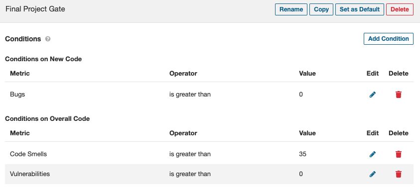

# Final Assignment A

In this assignment you will be constructing a complete pipeline with security related testing, both manual and automatic, for our AuthProvider module.  The assignment is less prescriptive than previous assignments.  The expectation is that you leverage what you have learned in previous assignments to incorporate and execute the specified security tests.  You can reference the previous assignments, reference material, and lectures for correctly completing the assignment.

### Assignment objectives:
- Create an end to end build pipeline incorporating appropriate security testing methods.
- Manually inspect code in a staged merge request
- Executing SAST testing and resolving issues to pass Qaulity Gate
- Executing dependency vulnerability scanning and resolve all issues.
- Successfully deploy your package to the package registry.

Grading will be based on commit history, pipeline execution, and dependency report  reflecting completing the steps below.

# Manual Security Testing

You are the senior software engineer (aka maintainer role) for your team responsible for reviewing merge requests into the mainline branch of your project.  

1. Clone the repository to your local environment.

2. Review the existing merge request in your project.

3. There are security related problems with this code.  In the comments section of the merge request specify what three problems exist with the code and ask the developer to fix them.

- You can look at the **changes** tab to see the diffs in the code.  

4. After adding your comments Close the merge request without merging.

5. Create a local branch **refactor-1** and correct the code.

6. Add, Commit, Push, and Merge the corrected code.

# SAST Security Testing

7. Create branch "pipeline-sast" and checkout

8. Change the pom.xml with the following changes:

- Replace **XXX** with your initials in the pom.xml \<name\> and \<artifactId\> xml tags

9. Run Maven locally to make sure your repository compiles and test correctly

10. Build a **.gitlab-ci.yml** file that performs the following pipeline stages:

- mvn compile
- mvn test
- Static Application Security Testing

In the stage instance for sonarqube modify the following line by replacine **XXX** with your initials.  This points to your specific SonarQube project.
>    - mvn verify sonar:sonar -Dsonar.projectKey=final-exam-a-XXX -Dsonar.qualitygate.wait=true

9. Add, Commit, Push, and Merge the pipeline file.  Ensure it completes successfully.

10. Log into SonarQube with your account and review the outstanding issues.

11. Create a branch **sast-issues** and resolve the issues necessary to pass the quality gate.

12. Add, Commit, Push, and Merge the branch.

13. Ensure the changes cause the SonarQube Quality Gate to pass

# Dependency Scanning Testing

14. Create branch "pipeline-depend-scan" and checkout

15. Add a Dependency Scanning stage to the build pipeline

16. Review the **Secure** Dependency Report

17. Update the **pom.xml** to correct any critical vulnerabilties

18. Add, Commit, Push, and Merge the branch.

19. Ensure the changes resolve the issues in the Vulnerability Report

# Deploy to Package Registry

20. Add a stage to deploy your AuthProvider module to the project **Package Registry**
