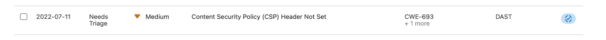

# Final Exam B

In this assignment you will be constructing a complete pipeline with security related testing, both manual and automatic, for our Web Application.  The assignment is less prescriptive than previous assignments.  The expectation is that you leverage what you have learned in previous assignments to incorporate and execute the specified security tests.  You can reference the previous assignments, reference material, and lectures for correctly completing the assignment.

### Assignment objectives:
- Create an end to end build pipeline incorporating appropriate security testing methods.
- Executing SAST testing and resolving issues to pass Qaulity Gate
- Executing dependency vulnerability scanning and resolve all issue
- Executing DAST testing and resolving several issues
- Make sure the **.war** file generated in the **mvn package** matches the file name use in the **aws** cli commands in deploy stage.

Your final pipeline run should look like the following:


Grading will be based on commit history, pipeline execution, and dependency report  reflecting completing the steps below.

Tips:
- Port for HTTP is 8080 for running web app locally (**mvn spring-boot:run**) and 5000 for deploying in AWS.  The mvn package needs to include the **sed** script commands to change it. (Assignment 5A)
- Remember to set AWS environment variables if running tests locally (Assignment 6A)
- Replace "XXX" in configuration files (pom.xml, sitemap.xml, .gitlab-ci.yml)

# Clone and Build a Web Application

1. Clone the assignment repository to your local development environment.

2. Create branch **pipeline-config** and checkout.

3. There are several configuration files that are important to modify:

    - **pom.xml** - Maven project file
        - Replace **XXX** with your usual auburn email name (e.g. pwb0016):
            - **\<name\>**
            - **\<artifactId\>**
        - AuthProvider respository change the **XXX** to Final Exam A **Project ID** (similar to as you did in Assignment 6b)
            - **\<repository\>**
            - **\<distributionManagement\>**
    - **src/main/resources/static/sitemap.xml** file
        - Replace **XXX** with your usual auburn email.  

4. Build a **.gitlab-ci.yml** file that performs the following pipeline stages:
- mvn compile
- mvn test
- mvn package
- Static Application Security Testing


In the stage instance for sonarqube modify the following line by replacine **XXX** with your auburn email name.  This points to your specific SonarQube project.  The **-s ci_settings.xml** is new and appended to the end.
>    - mvn verify sonar:sonar -Dsonar.projectKey=final-exam-b-XXX -Dsonar.qualitygate.wait=true -s ci_settings.xml

4. Add, Commit, Push, and Merge into main


5. Ensure the pipeline executes successfully


6. Login to SonarQube and review the 1 bug identified.


7. Resolve the bug back in **Final Project A** 

### Fix Defect in Dependency and Publish

8. Switch back to **Final Exam Project A**

9. Update **main** branch with any updates on remote repo.  Create branch **bug-serializable** and checkout

10. Update the UserSession class to implement the Serializable interface and include the import at the top of the file:
    ```java
    import java.io.Serializable;

    public class UserSession implements Serializable {
    ```
   


11. Set a new release version to 1.5 in the **pom.xml** for our AuthProvider 
     ```xml
     <version>1.5</version>
     ```
12. Add, Commit, Push, and Merge.  The pipeline will kickoff and deploy the new 1.5 version to the package registry.

# Update Web Application Dependency

13. Create branch **bug-update-auth** and checkout


14. In the **pom.xml** of **Final Exam Project B** update the AuthProvider dependency version to 1.5.
```xml
<dependency>
    <groupId>edu.auburn.cpsc4970</groupId>
    <artifactId>AuthProvider</artifactId>
    <version>1.5</version>
</dependency>
```
- Remember to replace XXX to your initials if you copy and paste or the name in the registory

15. Add, Commit, Push, and Merge to **main**. Ensure a successful pipeline Merge

16. Check SonarQube to make sure the issue no longer exists.

# Build out security testing in pipeline

17. Create branch "pipeline-security-test" and checkout

18. Add the following stages to your pipeline:
- depend-scan
- deploy 
- dast

You can name the jobs similar to the above diagram.

19. For the Dependency Scanning and DAST scanning the following lines are to the includes the configuration.
    ```yaml
    include:
      - template: DAST.gitlab-ci.yml
      - '/templates/Dependency-Scanning.gitlab-ci.yml'
    ```

21. Add, Commit, Push, and Merge to **main**. Ensure a successful pipeline Merge

22. Review the **Dependency list** Report.  This is typical of modern day Java web applications to have over 50+ external dependencies and is why the only way to manage the vulnerabilities on a daily basis is with automated scanning tools.
23. Update main branch.  Create branch "depend-updates" and checkout

24. Update versions for **critical** vulnerabilities in the dependencies and **high** postgres issues.
- For spring-boot related dependencies  update the version in the \<parent\> to 2.7.9
- It is ok to leave the other critical vulnerabilities.

# Correct Content Security Policy vulnerability

23. Review the **Security & Compliance** Vulnerability Report

24. A medium level vulnerability is **Content Security Policy (CSP) Header Not Set**.  It is important to add http headers to tell browsers where content (javascript, inline frames, css, images, etc) are allowed to be loaded from since they can come from other servers (CDNs, websites, etc.). Reference: [Content Security Policy](https://developer.mozilla.org/en-US/docs/Web/HTTP/CSP)

25. Create branch "bug-content-policy" and checkout

26. Add the following line in the class methods **WebPageController.setResponseHeader()** and **WebAPIController.setResponseHeader()**.  This will add the Content Security Policy in the HTTP headers.
```java
response.setHeader("Content-Security-Policy", "default-src 'none'; script-src 'self'; connect-src 'self'; img-src 'self'; style-src 'self';base-uri 'self';form-action 'self'");
```

27. Add, Commit, Push, and Merge to **main**. Ensure a successful pipeline Merge

28. You should see check mark to the right of the CSP error:



29. Click the check box and mark it as resolved.

# Congrats you have completed the final exam
 
 
