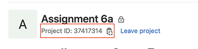
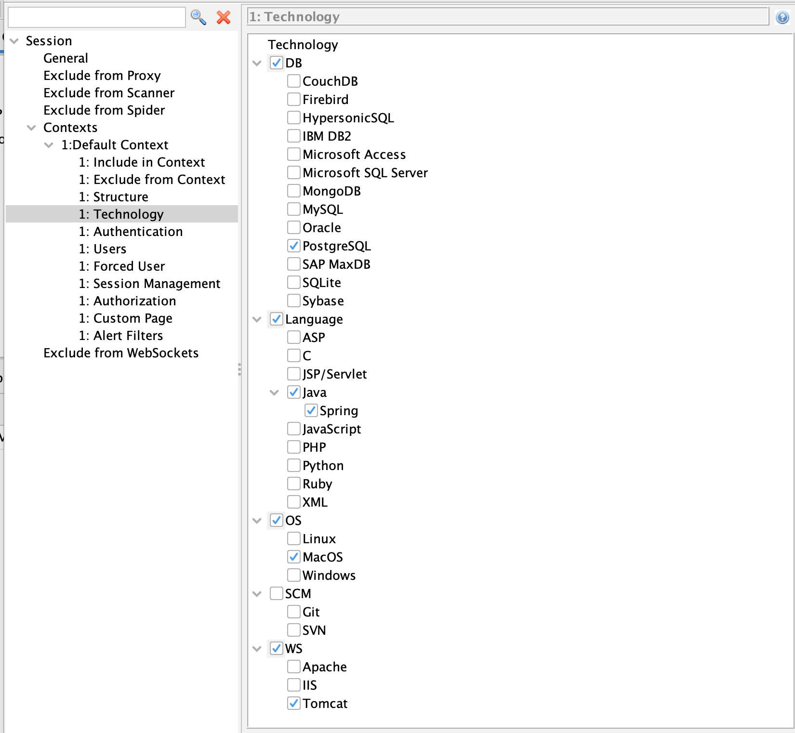
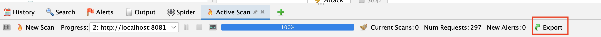
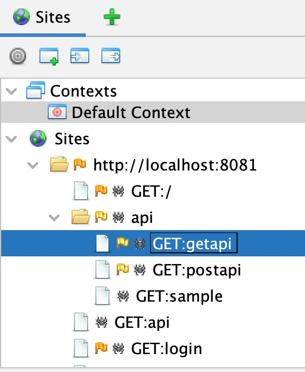

# Assignment 6b - DAST Security Testing a Java Spring Boot Web Application

In this assignment you will be building a basic web application with Java Spring Boot, configuring a Gitlab build pipeline to deploy to AWS Elastic Beanstalk, and executing a ZAP DAST scan on your local instance and deployed instance in AWS.

### Assignment objectives:
- Download and deploy the ZAP DAST testing tool
- Configure as a dependency the AuthProvider pushed to our local Gitlab registry  
- Create a Gitlab pipeline to build and deploy the application to AWS Elastic Beanstalk
- Execute a ZAP DAST scan through a Gitlab pipeline
- Configure the ZAP tool to test for our technology stack
- Use the ZAP tool to test a passive and active attack on a locally running web application
- Execute a fuzz test against a web applications HTTP GET and POST REST API

Grading will be based on commit history, test result files, pipeline execution, and successful AWS deployment reflecting completing the steps below.

# Clone and Build a Web Application

0. Clone the assignment repository to your local development environment.

+ This project was created with the following [Spring Initializr](https://start.spring.io/) options:

    - Project: Maven
    - Language: Java
    - Version 2.7.0
    - Group: edu.auburn.cpsc4970
    - Artifact: \<AU Email\>
    - Name: \<AU Email\>-app
    - Packaging: war
    - Java: 11
    - Dependencies: Spring Web, Thymeleaf

+ There are several additional files present:

    - **ci_settings.xml** - Maven global settings file that is referenced in our build pipeline.  It contains an environment variable that is set to permissions value.
   
# Deploy Web Application to AWS Elastic Beanstalk

1. Create branch **webapp-deploy** and checkout.

2. We are also going to add a **sitemap.xml** file in the **src/main/resources/static**.  This file helps search engines index a site, but can also be used by ZAP to know what URLs to crawl and test.
    ```xml
    <?xml version="1.0" encoding="UTF-8"?>
    <urlset xmlns="http://www.sitemaps.org/schemas/sitemap/0.9">
        <url>
            <loc>https://XXX.au-csse-cpsc4970.com/</loc>
            <lastmod>2022-06-04</lastmod>
        </url>
        <url>
            <loc>https://XXX.au-csse-cpsc4970.com/api/getapi</loc>
            <lastmod>2022-06-04</lastmod>
        </url>
        <url>
            <loc>https://XXX.au-csse-cpsc4970.com/api/postapi</loc>
            <lastmod>2022-06-04</lastmod>
        </url>
        <url>
            <loc>https://XXX.au-csse-cpsc4970.com/login</loc>
            <lastmod>2022-06-04</lastmod>
        </url>
        <url>
            <loc>https://XXX.au-csse-cpsc4970.com/</loc>
            <lastmod>2022-06-04</lastmod>
        </url>
    </urlset>
    ```
   - Replace **XXX** with you initials as usual

3. We need to add our Authentication module (AuthProvider from assignment 6a) to our web application.  Since we have already built this module we can define it as a dependency in our Maven pom.xml file.  It will be downloaded to your local repository (~/.m2 directory) from the Gitlab 6a project registry.  Make sure the version number matches the current version in your Gitlab package registry.

  - Alternatively, in your **Package Registry** for M6 Assignment A you can click on the current version of the AuthProvider artifact it will contain sample **pom.xml** entries with the project id.

    ```xml
    <dependency>
       <groupId>edu.auburn.cpsc4970</groupId>
       <artifactId>AuthProvider</artifactId>
       <version>1.3</version>
    </dependency>
    ```


4. To find our dependency we also have to define the repository where it is located.  This is the same definition used to publish in our previous assignment.  The following xml should be put under the top level \<project\> xml tag. The **\<Project ID\>** value below needs to be changed to the assignment 6a project id (see picture below for location) since that is where the registry is located.

    - Alternatively, in your **Package Registry** for M6 Assignment A you can click on the current version of the AuthProvider artifact it will contain sample **pom.xml** entries with the project id.

    ```xml
        <repositories>
            <repository>
                <id>gitlab-maven</id>
                <url>https://gitlab.com/api/v4/projects/<Project ID>/packages/maven</url>
            </repository>
        </repositories>
        <distributionManagement>
            <repository>
                <id>gitlab-maven</id>
                <url>https://gitlab.com/api/v4/projects/<Project ID>/packages/maven</url>
            </repository>
            <snapshotRepository>
                <id>gitlab-maven</id>
                <url>https://gitlab.com/api/v4/projects/<Project ID>/packages/maven</url>
            </snapshotRepository>
        </distributionManagement>
    ```



9. Configure the pipeline to deploy your web application.  Similar to assignment 5a replace the **XXX** in:

- **.gitlab-ci.yml** (2 places in **deploy** and **dast** stage) 

10. Add, Commit, Push, and Merge to **main** your changes.

11. Make sure you web app is deployed to the specified URL (replace **XXX**):

   ```http request
   https://XXX.au-csse-cpsc4970.com/
   ```
   
# Perform Automated DAST Test with ZAP

11. Download and install [Zed Attack Proxy (ZAP)](https://owasp.org/www-project-zap/) for your operating system.
- Watch the [exploring your applications with ZAP video](https://play.vidyard.com/p35FK8Cri5A3EF3RBGoMAr.jpg)
- Watch the [Passive Scanning video](https://play.vidyard.com/vDWpoYjHi7fSLYFDQPWgMF.jpg)
- Watch the [Active Scanning video](https://play.vidyard.com/ZcEfSihgQSzuthJi4qEeW3.jpg)


12. Configure the ZAP **Context** that applies to our web application. Double click on the "Default Context" with these settings:


- This will limit the tests to the specific technologies used by our web application
- For OS choose Linux

1. Perform an **Automated Scan** with ZAP against your locally running web application.  This will take a few minutes because of the time to connect to the secrets service in AWS and also the Postgres database in AWS.  Normally, the database connections are established when the web application starts and a pool of connections is allocated when needed.

2. As the scan is running examine the logs being generated where you are running the Spring Boot Web application.  A few things to take note:
   + Select "Request" from the top menu bar as you review the individual HTTP requests made by ZAP
     + HTTP POST - Notice the different types of body content attempting different exploits
     + HTTP GET - Notice the different types of URLs looking for files to exploit
   + ZAP will try to retrieve invalid pages and try to retrieve contents of directories
   + ZAP will try various login vulnerabilities, which are seen with the log messages "Attempting to login:"
       + SQL statements
       + Command line statements that could be executed with a logging framework
       + Oversized values for user and password
       + Attempts to access privilege Java web application files under WEB-INF
   + Some of these values will actually cause exceptions (mostly SQL) on the server side.  These could cause the application to crash, cause performance issues or put it into a bad state affecting the **Availbility** CIA principle.
   + On the top menu bar you can examine the HTTP Request sent and HTTP Response from the server for each ZAP request.

3. Create a file call **exploits.txt** in the root directory of the project.  Add the following in the file separat by blank lines.  Add it to the git staging area.
- HTTP POST body trying SQL Injection
- HTTP POST body attempting username/password
- HTTP POST body attempting to execute a local command
- HTTP GET attemping to get an encryption key file

15. Export the scan results by selecting the **Active Scan** tab and **Export** option on the tab level menu bar located on the right.  



16. Name the file **active_scan.csv**.  Place the file in the root of your repository and add it to the git staging area.

17. Add, Commit, Push, and Merge to **main** your changes.


# Fuzz Testing A Web API.


In this web application there are two generic REST APIs in the **WebAPIController** class.  In this section ZAP is used to execute a Fuzz test against these two APIs.  One API uses the HTTP GET method and the other uses HTTP POST method.  The main difference between the two methods:

+ HTTP GET
    + Used to retrieve data from a resource (URL)
    + Request parameters appended to the URL in the form of ?key1=value1&key2=value2...
    + Server should only let us receive the data and not change its state
+ HTTP POST
    + Used to create or rewrite a particular resource/data
    + Data sent to the server is stored in the request body section of the HTTP request
    + Server will create a new resource or update an existing one


18. Pull changes from remote repository.  Create branch **fuzz-test** and checkout branch.

19. From our previous scan ZAP recorded the different URLs of our web application.  Right click on the **getapi**:

 and select "Attack-->Fuzz".

20. We want to fuzz test parameter values appended to the URL. To specify where in the HTTP request to put values we put the cursor in the request header line (first line) immediately after **GET http://localhost:8081/api/getapi**

21. Select **Add** bring up the **Payload** dialog.

22. Select **Add** bring up the **Add Payload** dialog.

23. Add the following payloads by selecting the drop down at the top. Select **Add** button after each configuration.


  + **Empty/Null** - 15 repititions
  + **String Values**
    ```text
    ?
    ??
    ?&
    ?&&&
    ??&?&?&
    ?key
    ?key=value
    ?key=value&key=value
    ```
    + **Regex (Expiremental)** - this randomizes values to send into the server as request parameters
        + Regex: **?[a-z0-9]{4}=[a-z0-9]{4}**
            + [Reference for pattern](https://www.hahwul.com/2019/05/27/how-to-web-fuzzing-with-regex-pattern-on-zap/)
        + Select "Random Order"
        + Select "Generate Preview"

24. Select **Ok** when done adding payloads. You should see a green box cursor at the end of the *http* request URL.  This is where the payload values will be substituted.

25. Notice that as you move the cursor around in the HTTP Header section you can add fuzzing payloads to different areas.

26. Select **Start Fuzzer** to run your test.

27. Examine the log output on your web application console.  You should see the parameters received in the web application for each request.  Fuzz testing attempts to find flaws in the application by throwing the *kitchen sink* at the application.  A robustly built application will maintain stability and performance in the presence of invalid or flawed tests.

28. Select the "Fuzzer" tab and export the test results to a file name **fuzzer-getapi-results.csv**

29. Add the file to the root of your repository and add it to the git staging area.

# Fuzz Testing POST API

30. In the **Sites** tree right click on our **postapi**  and select "Attack-->Fuzz" from the pop up menu.

31. With a POST API we want to fuzz test the request body. Select "Add" to specify fuzz payload values. Put the cursor in the request body text area (should be blank) below the HTTP Header text area.

32. Select "Add" bring up the **Payload** dialog.

33. Select "Add" bring up the **Add Payload** dialog.

34. Select **Json** drop down at the top and put the following in the **Original Json** text area:
    ```json
    {
      "key" : "value",
      "list" : [
        {
          "key2": "value2",
          "key3": "value3"
        } 
      ]
    }
    ```
    
35. Select 100 iterations.

36. Select **Add** and then **Ok** to complete adding payloads

37. Run test by selecting **Start Fuzzer**

38. Examine the console log of the web application to see how ZAP changed the payload sent into the POST API.  Various valid and invalid payloads are sent into the web application.

39. Export the results to a file named **fuzzer-postapi-results.csv**

40. Add the file to the root of your repository and add it to the git staging area.

38. Add, Commit, Push, and Merge to **main** your changes.

